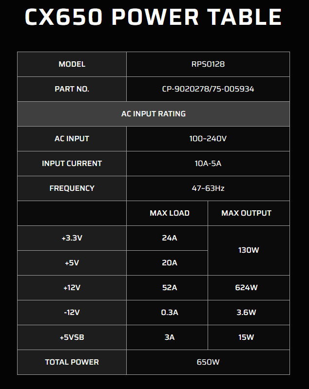

# Power Supply Summary

The Halbach magnet is passive (no power). Power is needed for gradient current source and RF transceiver amplifiers.

## Estimated Power Budget

- **Current Source (Linear)**
  - Voltage = 9-12 V DC bus
  - Current = 1–5 A per channel
  - Power Estimation = 5A x 10V x 5 = 250 W

- **RF Transceiver**
  - Transmitter = 100 W (RF)
  - Receiver = 50 W

- **Sensors & Cooling**
  - ~50 W

Total = 250W + 150W + 50W = 450W

I ordered this with 650W rating:

https://www.amazon.sa/-/en/dp/B0CJRXX5WT?ref=ppx_yo2ov_dt_b_fed_asin_title&th=1

